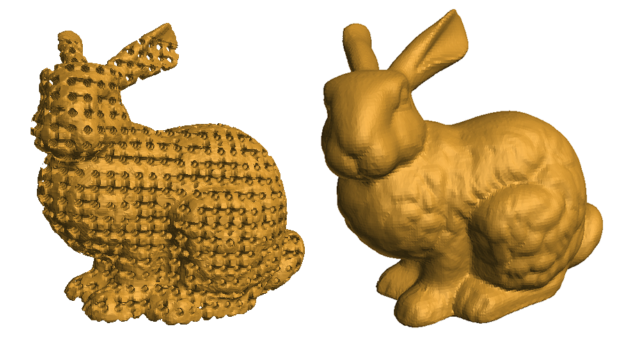
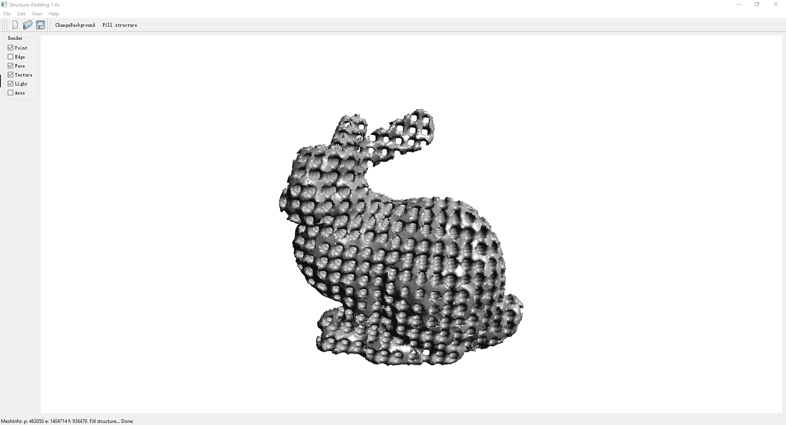

# 3dprint-lightweight-generate
The project is an simple demo of our paper **A simple and efficient manufacturing design method for additive manufacturing with multiple printing sizes**.

## Source Code
https://github.com/zoelsherry/3dprint-lightweight-generate-fft-app

## Run the Demo
1. Open , input the .obj in model folder.
2. Tick the `Light`, `Face`.
3. Press `Fill structure` to run the generate lightweight model.

## Gallery

## Dependencies
- FFTW
- Qt 5.12.3
- Visual Studio 2017
